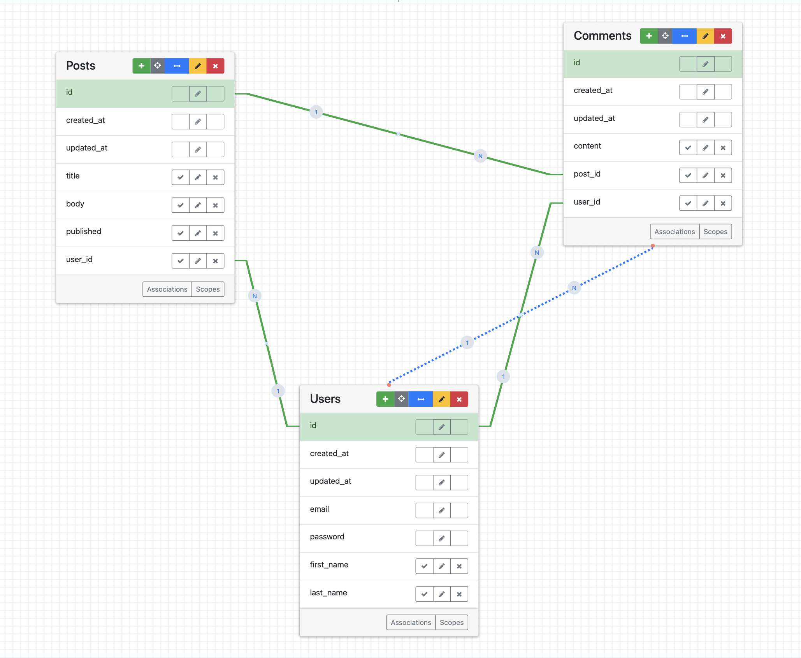

# Rails Active Record Teaching Repository

This repository is used to teach Active Record concepts in a Rails environment. The application is a simple blog system with users, posts, and comments that demonstrates key Active Record relationships and features.

## Topics Covered

This repository demonstrates several important Active Record concepts:

- **Associations:**
  - One-to-many relationships (User has_many Posts, Post has_many Comments)
  - Belongs_to relationships (Post belongs_to User, Comment belongs_to Post)

- **Basic CRUD Operations:**
  - Creating, reading, updating, and deleting records
  - Mass assignment and strong parameters

- **Queries:**
  - Basic Active Record queries
  - Scopes and custom finders

- **Authentication:**
  - User authentication with Devise
  - Authorization through private/public post visibility

## Setup Instructions

1. Clone the repository
2. Run `bundle install`
3. Create the database with `rails db:create`
4. Run migrations with `rails db:migrate`
5. Seed the database with `rails db:seed`
6. Start the server with `rails server`

## Entity Relationship Diagram (ERD)

